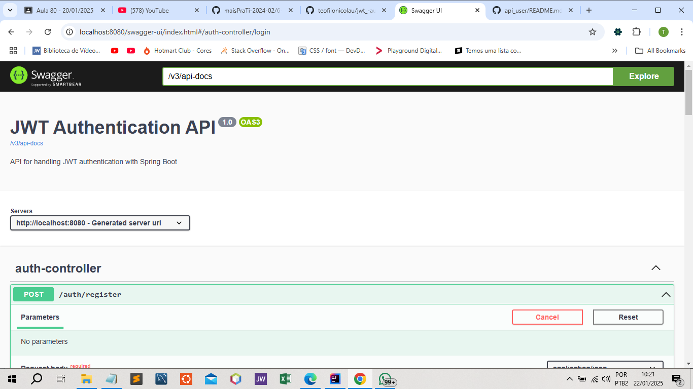

# JWT Authentication API

## Descrição

Essa API foi desenvolvida para realizar autenticação de usuários utilizando JWT (JSON Web Token). A API é construída com Spring Boot, Spring Security, e utiliza H2 Database para armazenamento de dados temporários.

## Funcionalidades

- **Registro de Usuário**: Permite que novos usuários se registrem na plataforma.
- **Login de Usuário**: Autentica os usuários e gera um token JWT.
- **Acesso Protegido**: Endpoints protegidos que requerem um token JWT válido para acesso.

## Endpoints Principais

- `POST /auth/register`: Registra um novo usuário.
- `POST /auth/login`: Autentica um usuário e retorna um token JWT.
- 

## Tecnologias Utilizadas

- **Spring Boot**: Criação da aplicação de forma rápida e produtiva.
- **Spring Security**: Implementação de autenticação e autorização.
- **JWT**: Autenticação baseada em token.
- **H2 Database**: Banco de dados em memória para fins de teste.
- **Lombok**: Redução do código boilerplate.
- **Swagger**: Documentação da API.

## Problemas Conhecidos

1. **Erro 403 ao Logar**: Atualmente, ao tentar fazer login, um erro 403 (Forbidden) é retornado. Isso indica que há problemas na autenticação, possivelmente em algum aspecto do filtro JWT ou configuração de segurança.
2. **Configuração do Swagger**: Certifique-se de que as URLs do Swagger estejam disponíveis sem autenticação para que a documentação esteja acessível.

## Como Contribuir

1. Clone o repositório:
   ```bash
   git clone https://github.com/teofilonicolau/jwt_-authentication_api.git
   ```
